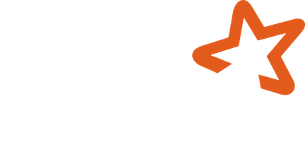
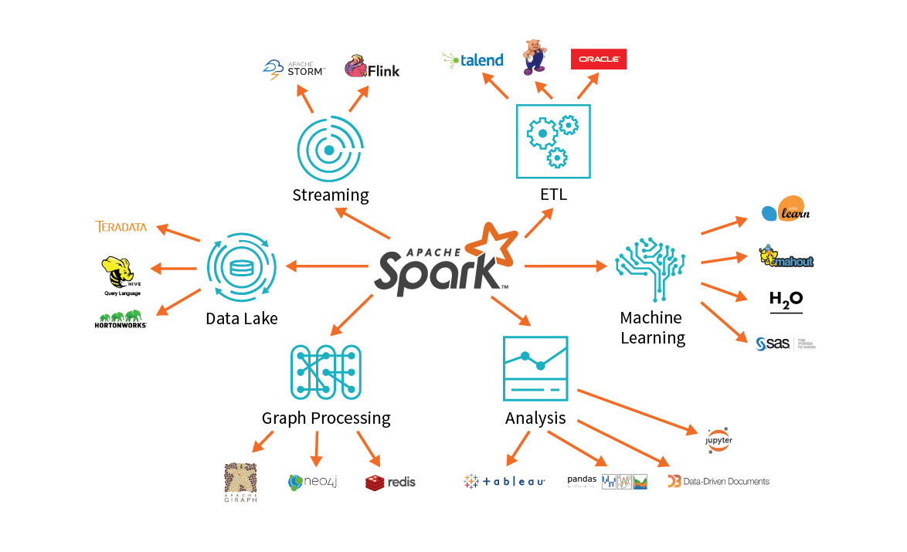

<!-- .slide: data-background-image="slideassets/background-gray-dimpled.jpg" -->
## Getting started with Big Data and Apache Spark

<!-- .slide: data-background-image="slideassets/background-gray-dimpled.jpg" -->
## You are here
* Where you are in the Course
* What you've already done
* What you'll walk away with

notes:
#### Synopsis
Help someone familiar with traditional database analytics and reporting understand the need for big data and how the concepts map, with a hands-on example for context.

#### Assumptions
* User has already set up a Databricks account
* User has already created a cluster

#### Primary objective
* Learn big data concepts with Spark and Databricks

#### Learning objectives
* List six use cases for big data
* List four primary tools used for big data analytics
* Map small data concepts and tools to big data
* Describe the three primary Spark dataset types
* Create and navigate a Databricks notebook
* Import a dataset
* Describe transformations and actions
* Use visualizations
* Save and share notebooks
* Identify next steps

<!-- .slide: data-background-image="slideassets/big-vs-small-gettyimages-628434004_large.jpg" -->
# From small to big

notes:
Let's talk about moving from Small Data to Big Data

Background: Getty images

<!-- .slide: data-background-image="slideassets/background-gray-dimpled.jpg" -->
## Why big data?
Not all jobs can run once daily on a single system<!-- .element: class="fragment" data-fragment-index="1" -->

notes:
So, why Big Data? To put it simply, because not all jobs can run once daily on a single system.

Small Data is generally considered to be datasets under 10TB and capable of being run on a single server.  

Examples of Small Data are Excel spreadsheets, pivot grids, SQL relational databases with specific attributes and schemas. This data is used for making short term business decisions, with a more comprehensible dataset. For longer term decisions, it takes time to build the views, reports and schedule the jobs to produce the analysis. For many datasets and decisions, this it the right choice.

Big Data goes beyond Small Data in terms of size, speed, and variation in the structure of data.
In making larger business decisions, you need analysis on a much larger pool of data from multiple sources, and much more quickly. If you are looking to increase revenue through your online store, you may want a recommendation system that is based on an ML analysis of product relationships, combined with a shopper's real-time browsing and purchasing history. Determining how to make this correlation often requires the skills of a data scientist, and to keep it running, it requires data engineers that can implement and maintain the infrastructure. It will still use some SQL for analysis and small data as sources, but will requires additional tools in the chain. Databricks is a platform that makes this easier to manage, not just for data scientists and engineers, but also for analysts with a small data background that have moved into the Big Data realm. The term "Citizen Data scientist" has emerged to describe this role, to fill the gap between the need for big data analytics and the relatively small number of available data scientists.

The amount of data collected every minute by organizations is staggering. The changed needed to address it is revolutionary change to the industry. It's a change on the same order on magnitude as the evolution of coding moved from linear to procedural to object oriented programming, or the shift from physical server to virtual to serverless elastic applications.

References:
https://www.dataversity.net/big-data-small-data/

<!-- .slide: data-background-image="slideassets/background-gray-dimpled.jpg" -->
## When would I use it?
1. When it's too big to run on one machine<!-- .element: class="fragment" data-fragment-index="1" -->
2. When you need it faster<!-- .element: class="fragment" data-fragment-index="2" -->

notes:
So, when would you use it? When it's too big to run on one machine or when you need it faster.

<!-- .slide: data-background-image="slideassets/Paperwork-Stack-Office-Paper-Data-Work-Files-1614223.jpg" -->
## What are some use cases?
* Loan risk analysis<!-- .element: class="fragment left" data-fragment-index="1" -->
* Suspicious behavior identification in videos<!-- .element: class="fragment left" data-fragment-index="2" -->
* Cyber security SIEM systems<!-- .element: class="fragment left" data-fragment-index="3" -->

notes:
There are numerous applications of Big Data analysis, but here are a few:

One use case is loan risk analysis. A credit card issuer could build a pipeline of data from multiple sources, and analyse it with and ML workflow, most likely with some regression techniques.

Monitoring security camera video feeds is tedious and hard to scale. A security monitoring company could utilize AI to look for suspicious behavior in videos. This might involve a pre-processing step to create image frames, image analysis to featurize the content of the frame, and applying logistic regression to identify suspicious images in a video.

Cybersecurity operations centers need to effectively detect and remediate threats in today’s environment. Security teams can utilize the Databricks platform to process and correlate massive amounts of real-time and historical data, detect patterns that exist outside pre-defined rules and reduce the number of false positives.

If you are interested in the specifics of these use cases, there are links to the use case documnets in the notes. These go into detail about the problems, the design of the solution and the challenges of implentation. They are great resources to learn from.

References:
https://pages.databricks.com/big-ebook-case-studies.html
https://insidebigdata.com/white-paper/four-machine-learning-use-cases-databricks/
https://databricks.com/blog/2017/12/04/improving-threat-detection-in-a-big-data-world.html

Background:
https://www.maxpixels.net/Paperwork-Stack-Office-Paper-Data-Work-Files-1614223

<!-- .slide: data-background-image="slideassets/background-gray-dimpled.jpg" -->
## What tools will I use?
* Apache Spark
* Databricks
* other tools

<!-- .slide: data-background-image="slideassets/background-gray-dimpled.jpg" -->
## So what is Apache Spark?
"Apache Spark is an engine for big data processing, with built-in modules for streaming, SQL, machine learning and graph processing."

notes:
Research project at UC Berkeley in 2009
APIs: Scala, Java, Python, R, and SQL
Built by more than 1,200 developers from more than 200 companies

diagram source:
https://brookewenig.github.io/img/home/Workload_Tools_2-01.png

<!-- .slide: data-background-image="slideassets/background-gray-dimpled.jpg" -->
## How does that compare to what I know?
* SQL DB --> HDFS, DBFS, Delta Lake
* data --> clustered fs (in memory)
* SQL --> Spark
* Shell --> Notebooks
* Apps --> Notebooks
* Code --> Notebooks
* Reporting --> Notebooks

notes:
## Making the leap
Moving from relational database data analytics to big data
like moving from procedure programming to object oriented. It's a big leap.

* data --> clustered fs (in memory)
* SQL --> Spark
* Shell --> Notebooks
* Apps --> Notebooks
* Code --> Notebooks
* Reporting --> Notebooks

## How do I get started?
First get some data scientist a on it to explore, and then data engineers to plumb it

* Where is your data now?
* How did it get there?
* How did you transform it?
* What happens when it updates?
* What happens when the schema changes?
* How do you know you are seeing the possibilities?
* Log into Databricks
* Access data sets

<!-- .slide: data-background-image="slideassets/background-gray-dimpled.jpg" -->
## Ok, so how do I install this on my machine?
* Er, you don't

<!-- .slide: data-background-image="slideassets/background-gray-dimpled.jpg" -->
## Where does Databricks fit in?
* Infra structure
* Clustering and scalability
* Job running
* UI and Notebooks
* Reporting

<!-- .slide: data-background-image="slideassets/background-gray-dimpled.jpg" -->
# Hands-on practice

## Sign up for Databricks CE
Import a notebook here
Download a PDF here

RDD
DAtaframe
Datasets

<!-- .slide: data-background-video="http://clips.vorwaerts-gmbh.de/big_buck_bunny.mp4" -->
## Import a dataset<!-- .element: class="fragment fade-out" data-fragment-index="1" -->

## View the data

## Perform some actions on it

## Perform some transformations

## Do this with SQL and Python

## Visualize

## Save and share notebook

# Next steps
